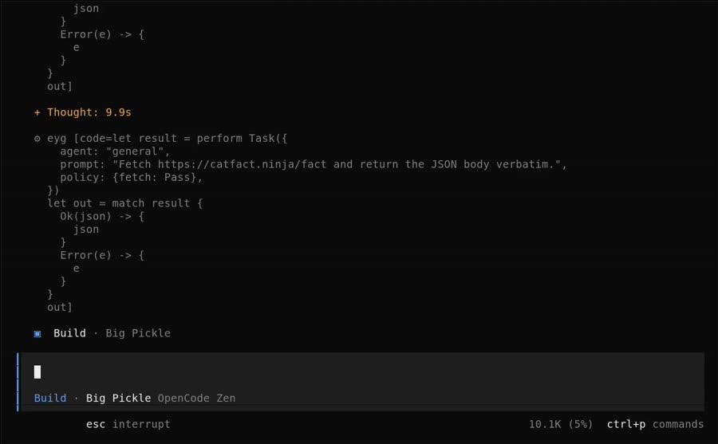

# EYG in opencode

Coding agents increasingly act by writing code rather than calling one tool at a time.
The code needs to be safe to run, and that is only true if the agent has no other way to act.
A sandboxed scripting language next to an unrestricted `bash` tool adds nothing.

EYG is a language where a program can only reach the outside world by performing an effect,
and the host decides what each effect does.
That makes it a natural replacement for the scripting layer of an agent:
every action is an effect, and every effect can be checked by a policy.

This post shows how far that can go in [opencode](https://github.com/anomalyco/opencode),
first with a plugin, then by changing opencode itself.
There are four levels.

| Level | What | How in opencode |
| --- | --- | --- |
| 1 | The agent can only script in EYG. | Permissions limit `bash` to the `eyg` executable. |
| 2 | EYG is a tool. | The plugin adds an `eyg` tool, the interpreter is bundled in the plugin. |
| 3 | Every program is checked by a policy, subagents keep it. | A policy in `.opencode/eyg.eyg` gates every effect. |
| 3.a | Subagents can have other policies, more restrictive or approved by the user. | `Task` and `Escalate` effects, and per agent policies. |
| 4 | EYG is the only tool, everything else is an effect. | Permissions hide every other tool, or a change to opencode, vendored in this repository. |

A [video](#video) at the end shows each level working on a variety of tasks.

## Install

The plugin is built from the [eyg-lang](https://github.com/CrowdHailer/eyg-lang) repository.
It needs [Gleam](https://gleam.run/install/) and [Bun](https://bun.com).

```sh
git clone https://github.com/CrowdHailer/eyg-lang.git
cd eyg-lang/packages/opencode_plugin
bun run build
```

This produces one file, `dist/eyg.js`, about 740KB.
It contains the plugin, the EYG parser and interpreter, and the policy runtime.
No `eyg` executable is needed.

Copy it into a project's plugin directory, or the global one to use it in every project.

```sh
mkdir -p .opencode/plugins
cp path/to/eyg-lang/packages/opencode_plugin/dist/eyg.js .opencode/plugins/
# or ~/.config/opencode/plugins/
```

Start opencode and ask for something that needs a program, i.e. "use the eyg tool to find the average age in people.csv".

The plugin is not published to npm yet.
Once it is, installing will be `opencode plugin opencode-eyg`, or adding `"opencode-eyg"` to the `plugin` list in `opencode.json`.

## Level 1, restrict bash to eyg

No plugin is needed for level 1.
Opencode's permissions can restrict the `bash` tool to commands that start with `eyg`.

```json
{
  "$schema": "https://opencode.ai/config.json",
  "permission": {
    "bash": { "*": "deny", "eyg *": "allow" }
  }
}
```

The agent then runs `eyg run -c '...'` or writes a file and runs `eyg script file.eyg`.
Read, write and edit tools remain, and the model needs to be told how to write EYG, an `AGENTS.md` pointing at the [syntax guide](https://eyg.run/guides/eyg-syntax-guide.md) works.

This is a small step.
What has gone is the shell: no process spawning, no pipes into other interpreters.
But the `eyg` CLI performs every effect a script asks for, there is no policy.
In the recording the agent is asked to run `curl -s https://example.com`, the command is denied,
so it writes the same request with EYG's `Fetch` effect and gets the page anyway.

## Level 2, the eyg tool

With the plugin installed the agent has an `eyg` tool that takes EYG source code.
Programs run inside opencode's process, the result is the program's final value and anything written with `StandardOut` or `StandardError`.

The plugin adds a section to the system prompt.
It lists the effects the agent may perform, with their types, and includes EYG's syntax and builtins guides,
so models that have never seen EYG can write it without fetching documentation.

Without any configuration the plugin uses a [default policy](../../packages/opencode_plugin/plugin/default.eyg):
files and directories inside the project can be read and changed, and nothing else.

```text
> Using the eyg tool, compute the average age in people.csv, then try to read /etc/hostname with eyg too.

eyg ReadFile, StandardOut
Average age: 40.5
eyg ReadFile
ReadFile Error: outside the project: /etc/hostname
```

## Level 3, policies

A policy is an EYG record of gate functions, one field for each effect, named in snake case.
`ReadFile` is decided by `read_file`, `Fetch` by `fetch`.
A gate receives the value the program performed the effect with and returns either

- `Pass(lift)` to perform the effect, with the same or a changed value, or
- `Mock(lower)` to resume the program with a value, without performing the effect.

An effect without a field is unavailable.
Pure effects, `DecodeJSON`, `EYGParse`, `Flip`, `Hash` and `Random`, and output, `StandardOut` and `StandardError`, are available unless the policy has a gate for them.
`Exit` and `StandardIn` are never available.

The configuration is an EYG program in `.opencode/eyg.eyg`, `~/.config/opencode/eyg.eyg` or the file named by `OPENCODE_EYG_CONFIG`.
It returns a record with a `policy` and optionally a `context` and `agents`.
It is evaluated once, and again whenever it changes, and can perform any effect, it is written by the user.
The [overlay EYG package](../../eyg_packages/overlay/) has helpers that make policies short.

```eyg
let {read_write, fetch_hosts, with_header} = import "../eyg-lang/eyg_packages/overlay/policy.eyg"
let {github_token} = import "./.env.eyg"
let files = read_write(["/home/me/project"])

{
  policy: {
    read_file: files.read_file,
    read_directory: files.read_directory,
    write_file: files.write_file,
    make_directory: files.make_directory,
    // The token is added to requests by the policy, the agent never sees it.
    fetch: with_header("api.github.com", "authorization", github_token, fetch_hosts(["eyg.run"])),
    standard_out: (text) -> { Pass(!string_replace(text, github_token, "****")) }
  },
  context: {readme: "Issues for this project are on GitHub at CrowdHailer/eyg-lang."}
}
```

A few details make policies easy to write.

- Paths are absolute before a gate sees them, relative paths are resolved from the project directory.
- Relative imports in the agent's programs are checked by the `read_file` gate.
- Gates are pure, they can transform values but cannot perform effects themselves.
- Only fields that already exist can be overwritten in an EYG record, `{task: Pass, ..files}` fails.
  List each field you want, as above.
- `context` is in scope as `context` in every program, a `readme` field is added to the system prompt.

Every session uses the same policy, including subagents started with opencode's `task` tool,
a session without a policy of its own takes its parent's.

A policy only matters if EYG is the agent's only way to act.
Asked to write TODOs into `notes/todo.md` and append a line to `README.md` under a policy that only allows writes in `notes/`,
the agent wrote the first with EYG and simply used opencode's `edit` tool for the second.
So at level 3 deny the tools that would go around the policy, keeping `read`, `glob` and `grep` which only read.

```json
{
  "$schema": "https://opencode.ai/config.json",
  "permission": {
    "edit": "deny",
    "bash": { "*": "deny", "eyg": "deny" }
  }
}
```

With that the README write is performed with `WriteFile`, the gate answers `Mock(Error(...))`, nothing is written, and the agent reports that the policy blocked it.
(`bash` is kept listed but denied for the reason in [level 4](#level-4-eyg-is-the-only-tool).)

## Level 3.a, more policies

Policies can be given to opencode agents by name with the `agents` field.
A session of that agent uses this policy instead of its parent's.
These are written by the user so they count as approved.

The agent can start subagents itself with two effects, both take `{agent: String, prompt: String, policy: {..gates}}` and return the subagent's final answer.

- `Task` restricts.
  The subagent's policy is the caller's, or the agent's configured policy, and the given policy on top.
  For each effect the child's gate runs first and a `Pass` value is checked by the parent's gate.
  An effect missing from either is unavailable.
  A subagent can never do more than its starting policy allows.
- `Escalate` replaces.
  The given policy is used as is, and opencode asks the user to approve it with the `eyg_escalate` permission.
  Set `"permission": {"eyg_escalate": "ask"}`, opencode allows unknown permissions by default.

Each is only available if the caller's policy has a `task` or `escalate` gate, and that gate sees the request, so it can limit which agents may be started or what they are asked.

## Level 4, EYG is the only tool

Level 4 removes every other tool.
The top level agent follows hard rules and is not able to reach untrusted content,
it writes the policies its subagents run with.

With the plugin this is a permission rule that hides every tool except `eyg`.

```json
{
  "$schema": "https://opencode.ai/config.json",
  "permission": { "*": "deny", "eyg": "allow" }
}
```

OpenCode Zen's free models refuse requests that do not include opencode's `bash` and `read` tools,
so to use them keep those two listed but deny every call, a rule whose last pattern is not `*` does not hide the tool.

```json
{
  "permission": {
    "*": "deny",
    "eyg": "allow",
    "bash": { "*": "deny", "eyg": "deny" },
    "read": { "*": "deny", "eyg": "deny" }
  }
}
```

The configuration below gives the top level agent the project's files and no network.
The `general` subagent can fetch from three hosts and read the project, but cannot write.

```eyg
let {read_write, read_only, fetch_hosts} = import "../eyg-lang/eyg_packages/overlay/policy.eyg"
let project = "/home/me/project"
let files = read_write([project])
let readable = read_only([project])

{
  policy: {
    read_file: files.read_file,
    read_directory: files.read_directory,
    write_file: files.write_file,
    make_directory: files.make_directory,
    task: Pass
  },
  agents: {
    general: {
      read_file: readable.read_file,
      read_directory: readable.read_directory,
      fetch: fetch_hosts(["eyg.run", "api.github.com", "catfact.ninja"])
    }
  }
}
```

Asked to save a cat fact from `catfact.ninja`, the agent reasoned that it had no `Fetch` effect but the `general` agent did, and ran

```eyg
let fetched = perform Task({
  agent: "general",
  prompt: "Fetch https://catfact.ninja/fact with the Fetch effect (GET). Decode the JSON response and return ONLY the plain text value of the \"fact\" field, nothing else.",
  policy: {fetch: Pass, decode_json: Pass}
})
```

and then wrote `cat.md` itself.
The subagent's text comes back as a string, the parent can still be influenced by it, but only within its own hard rules.

The plugin cannot finish level 4.
Opencode's other tools, `grep`, `edit`, `webfetch`, MCP servers, and those of other plugins, cannot be represented as effects,
a plugin has no way to call another tool (see the [appendix](#appendix-what-made-the-plugin-hard)).
EYG has its own file and fetch effects, so the agent can still work, but it loses opencode's implementations.

## EYG only, in opencode itself

A change to opencode itself, in `packages/opencode/src/session/tools.ts` and `src/tool/eyg/` of the vendored copy, goes the rest of the way.

When a session's tools are resolved every tool, built in, from a plugin or from an MCP server, is turned into an EYG effect.
`read` becomes `Read`, `apply_patch` becomes `ApplyPatch`, and an MCP tool `github_search` becomes `GithubSearch`.
The model is given one tool, `eyg`, whose description lists the effects the session's policy allows, with types derived from each tool's JSON schema, and the guides.

```eyg
match perform Grep({pattern: "TODO", include: "*.gleam"}) {
  Ok(lines) -> { perform Write({file_path: "TODO.md", content: lines}) }
  Error(reason) -> { Error(reason) }
}
```

- Field names are snake case in EYG, `filePath` is written `file_path`, and mapped back using the tool's schema.
- The tools run exactly as before, so opencode's own permissions still apply on top of the policy, an edit can still ask for approval.
- `Task` takes an extra `policy` field.
  The task tool reports the session it creates, so the policy is attached before the subagent runs its first step.
- `OPENCODE_EYG` sets the mode.
  `only`, the default, gives the model just `eyg`.
  `gate` also lists opencode's tools, but each call runs as the program `perform Tool(args)` under the same policy, this is how the free Zen models can be used.
  `off` is opencode as usual.

Opencode is vendored in this repository at [`vendor/opencode`](../../vendor/opencode/).
The commit `vendor opencode as is` adds upstream `dev` unchanged, the five commits after it make the change.
Run it from the vendored copy.

```sh
cd vendor/opencode
bun install
cd packages/opencode
bun run --define 'OPENCODE_VERSION="1.18.35"' src/index.ts /path/to/project
```

The version is needed by OpenCode Zen's free models, a build from source reports `local`.
`OPENCODE_EYG=gate` before the command selects gate mode.
Its tests are in `test/session/tools-eyg.test.ts`.

## Video

[](./opencode-eyg.mp4)

The [recording](./opencode-eyg.mp4), six minutes, shows each level on the same small project, with OpenCode Zen's free Big Pickle model.
Agent turns are sped up 2.5 times, the configuration shown before each scene is not.

1. **Level 1**, an average from a CSV file with an EYG script, then `curl`, which is denied, and the agent fetching the page with EYG anyway.
2. **Level 2**, TODO comments found, with opencode's grep and the `eyg` tool side by side, then reading `/etc/hostname`, outside the project, refused by the default policy.
3. **Level 3**, TODOs written to `notes/todo.md`, and a line appended to `README.md` refused by the policy.
4. **Level 3.a and 4**, a cat fact saved without the top level agent fetching, it starts a `general` subagent with `Task` and `{fetch: Pass}`.
   Then an `Escalate` to a subagent that can fetch and write in `notes/`, approved in opencode's permission dialog.
5. **EYG only in opencode itself**, in gate mode, an EYG program performs opencode's `Grep` and `Write` tools, and a direct `bash` call is refused by the policy.

Opencode was run from source, the vendored copy with the EYG commits, with `OPENCODE_EYG=off` for the plugin scenes, which is the same code path as `dev`.
Nothing in the recording is scripted except the prompts, the model's runs vary.

## What opencode does that overlay does not

[Overlay](../../packages/overlay/) is EYG's own agent, a pathfinder rather than a product.
On the `overlay-tui` branch it has a CLI agent, a terminal UI built on OpenTUI with a REPL and structural editor, a web agent with artifacts shared through the hub, and an eval harness.
It has one tool, `run`, its configuration is an EYG program, and its providers are Ollama, Mistral, OpenAI compatible APIs, Bedrock and Codex.

Opencode does all of the following, overlay does none of them, or only the part noted.

**Tools**

1. Built in tools for shell, read, write, edit, apply patch, glob, grep, web fetch, todo lists, questions with options for the user, skills, LSP queries and plan mode.
2. Web search, through OpenCode Zen or Exa and Parallel.
3. Code mode over MCP tools with a confined JavaScript interpreter (`execute`, experimental).
4. MCP servers, local and remote, with OAuth, tools and resources.
5. Custom tools as TypeScript files in `.opencode/tool/`.
6. Tool output truncation that saves the full output to a file the agent can read.
7. Edit and write tools that choose between exact replacement and patches by model, `apply_patch` for GPT models.

**Agents**

8. Several primary agents, build and plan, switched with Tab.
9. Subagents started with the `task` tool, general, explore and scout built in, run in the foreground or background, resumable by id, with a depth limit, and each with a permission set derived from its parent session and its own configuration.
10. Custom agents in markdown or JSON, each with its own prompt, model, temperature, step limit and permissions, and `opencode agent create` to write one.
11. Hidden agents for titles, summaries and compaction, using a small model, so sessions are named automatically.

**Permissions and policy**

12. Allow, ask or deny rules per tool, per agent and per session, with wildcard patterns and parsed shell commands.
13. An interactive approval dialog with Allow once, Allow always for the rest of the session, and Reject, and a tool can ask for approval of any named permission.
14. A guard on paths outside the project directory.
15. Provider policies, i.e. denying a provider for an organisation.
16. Managed configuration for enterprise deployments.

**Models**

17. Over 75 providers through the AI SDK and models.dev, logging in from the TUI or with `opencode auth login`, OAuth for GitHub Copilot, ChatGPT and others, and OpenCode Zen and Go. Overlay has five providers and reads a Codex login from disk.
18. Free models on OpenCode Zen, for requests from opencode.
19. Model variants, i.e. reasoning effort, a separate small model, and `opencode models` to list what is available.
20. Prompt caching, and token and cost tracking with a `stats` command.

**Sessions**

21. Sessions saved in SQLite, listed, resumed, continued, forked, imported from a file or URL, and deleted with `opencode session`. Overlay can only export a chat, in opencode's format.
22. Automatic compaction when the context fills, and `/compact`.
23. Undo and redo of messages, reverting file changes using snapshots of the project.
24. Diffs of each message's changes.
25. Sharing a session with a public link, manually or automatically, unsharing, and a data retention policy.

**Context**

26. `AGENTS.md`, and Claude Code's `CLAUDE.md`, global and project rules.
27. `/init`, which reads the repository, asks targeted questions and writes or improves `AGENTS.md`.
28. Extra instruction files from paths and globs in the `instructions` setting.
29. Skills in `SKILL.md` files, including Claude Code's.
30. `@` references to files and agents, and files or images attached to a prompt.
31. Custom slash commands from templates with arguments, shell output and file references, run in a chosen agent or model or as a subtask.
32. `!` to run a shell command and add its output to the conversation.

**Code intelligence**

33. Language servers started for the project, with diagnostics given to the agent after edits.
34. Formatters run after edits.
35. A file watcher, so changes made outside opencode are noticed.

**Interfaces**

36. A TUI with themes, configurable keybindings, model, agent and session pickers, a thinking toggle, `/details` to show or hide tool details and an external editor for prompts.
37. `opencode run` for non interactive use, with JSON output.
38. A headless server with an HTTP API and generated SDKs, `attach` to a running server.
39. A web interface and a desktop app.
40. IDE extensions that open opencode in a split terminal, share the current selection or tab, and insert file references with line ranges.
41. The Agent Client Protocol for editors such as Zed.
42. Agents for GitHub and GitLab that run in CI, installed with `opencode github install`, `opencode pr` to check out a pull request, and a Slack bot.

**Extensibility and operations**

43. Plugins with hooks for events, chat parameters, headers, system prompts, tool definitions, tool calls, permissions, shell environment, compaction and auth, loaded from files or npm and installed with `opencode plugin`.
44. TUI plugins.
45. `--pure` to run without external plugins.
46. Workspaces and git worktrees, several projects served by one server.
47. Layered configuration, global, project, managed and environment, with a JSON schema.
48. Management commands: `opencode mcp add`, `list`, `auth`, `logout` and `debug` for MCP servers, `opencode db` for the database, `opencode debug` for troubleshooting, and shell completion.
49. An HTTP proxy with authentication and custom certificate authorities for corporate networks.
50. Windows support, including a desktop app or web client on Windows talking to a server in WSL.
51. Install scripts, packages, self upgrade and uninstall.

Overlay has things opencode does not: a policy deciding every effect, configuration that is a typed program, type checking of agent code against its context, a REPL and structural editor for the same language, artifacts, and evals that can grade what a program did rather than what the model said.

## Appendix, what made the plugin hard

Each difficulty is followed by how it could be solved in opencode itself.
The change to opencode solves the first three.

### 1. A plugin cannot call other tools

Level 4 needs every tool available as an effect.
A plugin tool gets a context with the session, agent, directory, `abort`, `metadata` and `ask`, but nothing to run another tool,
and the SDK client has no endpoint for it.
So the plugin can only offer EYG's own effects and the subagents it starts.

**In core**: add `tools` to the tool context, `ctx.tools.list()` and `ctx.tools.execute(id, args)`,
running the tool through the same plugin hooks and permission checks as a model's call.
The branch does this inside `SessionTools.resolve`, where every resolved tool and the context to run it are available.
Opencode's existing code mode tool (`src/tool/code-mode.ts`) already wraps MCP tools this way for JavaScript,
generalising it to all tools, and to more than one language, would give the same result.

### 2. The tool description is the same for every session

A plugin tool's description is fixed when the plugin loads.
The effects available depend on the session's policy, so the plugin puts them in the system prompt instead,
with the `experimental.chat.system.transform` hook, and records each session's agent in the `chat.message` hook.

**In core**: give the `tool.definition` hook the session and agent, or let a tool's description be a function of them.
The branch builds the description for each session when its tools are resolved.

### 3. Subagents cannot be given a policy

Opencode's `task` tool creates the child session and runs it in one step, a plugin cannot attach anything to the new session before it starts.
The plugin starts its own subagents with the SDK, `session.create` then `session.prompt`, so that it knows the new session's id,
and finds the policy of sessions started by the `task` tool by walking up their parents with `session.get`.

**In core**: a hook when a session is created, with its parent and the tool call that created it, or a way to pass data from a tool call to the session it creates.
The branch uses the task tool's `metadata` call, which already reports the new session's id before the subagent runs.

### 4. Plugin state does not survive a restart

A policy contains EYG functions, so the plugin keeps each session's policy in memory.
After a restart a resumed subagent session falls back to its agent's or the configured policy.

**In core**: storage for plugins scoped to a session.
For EYG the policy can be stored as source, or as the hash of its IR, and evaluated again.

### 5. Hiding tools is a permission

Level 4 hides tools with `"*": "deny"`, which works because a rule that denies every pattern removes the tool from the request.
OpenCode Zen's free models refuse requests without the `bash` and `read` tools, so those have to stay listed with every call denied.
The branch has a `gate` mode for the same reason.

**In core**: a tool set for an agent, separate from what is allowed, and a free tier that accepts any opencode request.

### 6. Level 1 has no policy

`"eyg *": "allow"` is a prefix match on a command line.
It stops the shell but the `eyg` CLI performs every effect a program asks for.

**In EYG**: a `--policy` flag for `eyg run` and `eyg script`, using the same runtime as the plugin, would make level 1 almost as strong as level 3.

### 7. Opencode's names are not EYG names

EYG fields are lower case, so `{filePath: "..."}` does not parse, the branch maps `file_path` to the name in the tool's schema.
Optional arguments are left out, EYG has no null, and booleans are `True({})` and `False({})`.

**In core**: nothing, this belongs in the adapter, but JSON schemas with snake case names would avoid it.

### 8. Output and input

A program cannot write to opencode's terminal or read its input.
`StandardOut` and `StandardError` are captured into the tool result, `StandardIn` and `Exit` are unavailable.
Relative paths are resolved from the session's directory, not the process's, as one opencode server can serve several projects.

### 9. Building Gleam for JavaScript

The plugin is written in Gleam, compiled to JavaScript and bundled with Bun into one file.
Gleam modules export plain functions, but their values are classes, results have `isOk()` and lists have `toArray()`, so the plugin works with them through a small typed interface (`runtime.d.ts` on the branch).
A plugin published to npm would hide this, it is the reason it is not published yet.

### 10. Not checked before running

Overlay type checks the agent's program against its context before running it, the plugin does not yet, a type error is found when the program runs.
Effects from opencode's tools are typed from JSON schema, which cannot describe everything EYG can.

### 11. The user cannot see what they approve

`Escalate` asks with opencode's permission dialog, which shows "Call tool eyg_escalate" and the choices Allow once, Allow always and Reject.
The agent, prompt and policy are in the request's metadata but the dialog does not show it, and "Allow always" would approve every later escalation.

**In core**: show a permission request's metadata, or let a plugin render its own permission requests.
For EYG the policy should be shown as source, which means keeping the source with the value.

### 12. Models need to be told about policies

Two things went wrong in the first recordings.
The agent wrote gates comparing paths with `"notes/"`, but gates see absolute paths, so the plugin now says so in the system prompt.
And it stopped to ask "Confirm and I'll run it" before every effectful program, the prompts in the recording ask it to go ahead.
