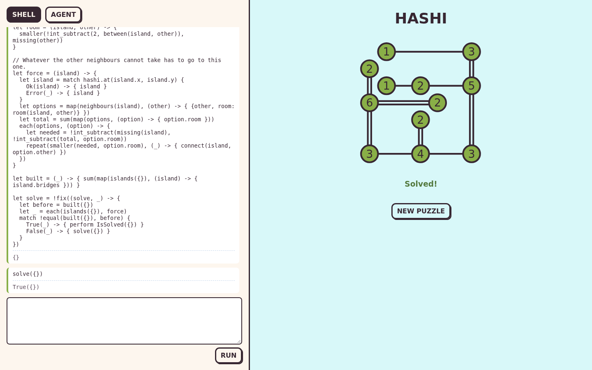
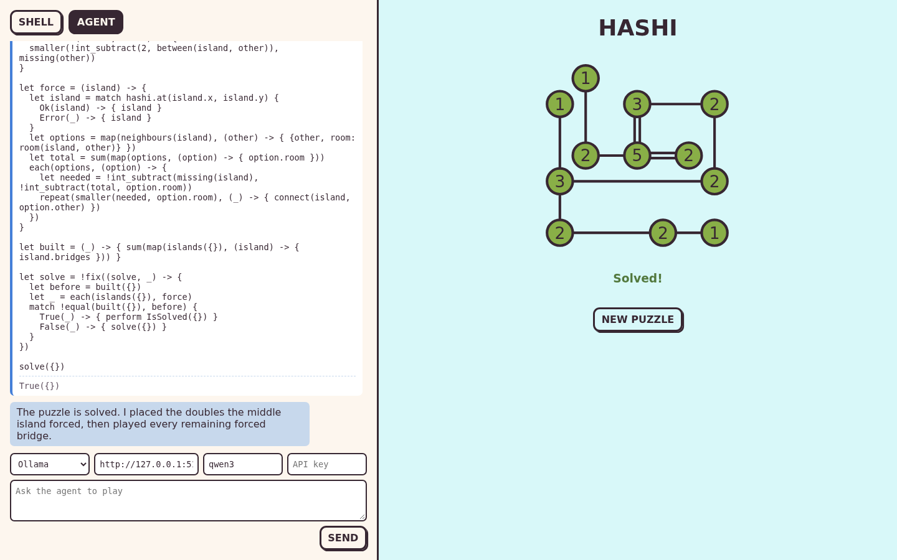

# Scripting and agents for a Gleam game

[Hashi](https://github.com/giacomocavalieri/hashi) is a daily puzzle written in Gleam and Lustre.
Islands carry a number, and the player joins them with bridges until every island has that many.
This post adds two ways to play it that the original does not have:
a shell where you play by writing [EYG](https://eyg.run), and an agent that plays by writing EYG for you.
Both reach the game the same way, through a handful of effects, and neither can do anything else.

The code is in [`examples/hashi`](../examples/hashi). The EYG side is `eyg_embed`, from [`packages/gleam_embed`](../packages/gleam_embed),
which the example depends on by path until it is published, with the parser, analysis and interpreter it builds on.

## What had to change in hashi

Nothing. The game is a git dependency, pinned to a commit, and none of its source is touched:

```toml
frontend = { git = "https://github.com/giacomocavalieri/hashi", ref = "6ad02b9...", path = "frontend" }
shared = { git = "https://github.com/giacomocavalieri/hashi", ref = "6ad02b9...", path = "shared" }
```

The first version of this example did change it.
It added a public `add_bridge` to the board, because the board only builds a bridge when a pointer presses on one island and then another,
and a move that breaks the rules quietly does nothing.
That is the right behaviour for a finger and seemed like no use to a program.

It turns out a program can press islands too.
`hashi_grid.update` and its `Message` type are public, so adding a bridge is two presses, exactly as a player makes it,
and whether it worked is a question the public `current_solution` can answer:

```gleam
pub fn add_bridge(board: Board, from: Point, to: Point) {
  use <- check_move(board, from, to)
  case bridge_between(board, from, to) {
    Ok(hashi.Double) -> Error(effect.Full)
    _ -> {
      let before = hashi_grid.current_solution(board.grid)
      let board = press(board, from) |> press(to)
      case hashi_grid.current_solution(board.grid) == before {
        // The second press found no bridge to build and selected `to` as the
        // start of a new one, that board is thrown away.
        True -> Error(effect.NotReachable)
        False -> Ok(board)
      }
    }
  }
}
```

Every rule, crossing bridges, islands out of line, a third bridge, is decided by the original code.
The host only reports why a move did nothing, which the original had no reason to say.

Three things were worth knowing:

- The board's model is opaque and does not hand back its puzzle, so the host keeps its own copy to list islands with `hashi.has_island` and `hashi.island_rank`.
- A doc comment in `shared/hashi` places `(0, 0)` bottom left. The board draws it top left, and the host follows the drawing.
- The stylesheet lives in the project's backend, not in either Gleam package, and the project has no licence file.
  `bin/fetch_style.eyg` downloads it from the pinned commit into an ignored directory rather than copying it in.

The project also asks that LLM tools are not used to write issues or pull requests to it, so nothing here is sent upstream.

## Part one: a scripting environment

### Choose the effects

An EYG program can only reach the world through effects, and the host decides which exist.
These are the whole of this game:

| Effect | Takes | Returns |
| --- | --- | --- |
| `ListIslands` | `{}` | `List({x, y, target, bridges})` |
| `ListBridges` | `{}` | `List({from: {x, y}, to: {x, y}, count})` |
| `AddBridge` | `{from: {x, y}, to: {x, y}}` | `Ok({})` or `Error` of `NoIsland({x, y})`, `NotReachable({})`, `Full({})`, `AlreadySolved({})` |
| `RemoveBridge` | the same | `Ok({})` or `Error(NoBridge({}))` |
| `Undo`, `Redo` | `{}` | `True({})` if anything changed |
| `IsSolved` | `{}` | `True({})` or `False({})` |
| `Print` | `String` | `{}` |

[`effect.gleam`](../examples/hashi/src/hashi/effect.gleam) gives each a name, the type lifted out of the program, the type lowered back in,
and a decoder, using `touch_grass`'s `Interface`:

```gleam
Interface(
  "AddBridge",
  move_type(),
  t.result(t.unit, refusal_type()),
  decode_move(_, AddBridge),
),
```

The types are what makes the rest safe. A program is checked against them before it runs,
so `perform Fetch(...)` or `perform AddBridge({form: ...})` is refused with nothing done.

### Start a shell

A shell from `eyg_embed` is given the effects' types, and a library to put in scope:

```gleam
pub fn start(library: String) -> Result(Shell, String) {
  shell.new(effect.types()) |> shell.with_module("hashi", library)
}
```

[`library.eyg`](../examples/hashi/library.eyg) is an EYG module with helpers such as
`hashi.neighbours(island)`, `hashi.missing(island)` and `hashi.connect(a, b)`.
It is pure: its functions perform effects when they are called, but building it performs none.
It also carries a `readme`, the paragraph the agent will be given about the game.

### Run code

Each piece of code a person types goes to `shell.run` with the host's state and a handler.
The shell parses it, checks it against the effects and every variable defined so far, runs it,
and hands back the new shell, with the new variables and their types, and the new state.
The handler is the only game specific part, turning an effect into a move on the board:

```gleam
pub fn run(shell: Shell, board: Board, code: String) -> Run {
  let shell.Run(shell:, state: #(board, printed), outcome:) =
    shell.run(shell, code, #(board, []), handle)
  Run(shell:, board:, printed: list.reverse(printed), outcome:)
}

fn handle(game, label, lift) {
  let #(board, printed) = game
  case effect.cast(label, lift) {
    Ok(effect.Print(line)) -> Ok(#(#(board, [line, ..printed]), v.unit()))
    Ok(request) -> {
      let #(board, reply) = answer(board, request)
      Ok(#(#(board, printed), reply))
    }
    Error(_) -> Error("not a " <> label)
  }
}
```

Every effect here is synchronous, so a whole program runs inside Lustre's `update`.
A host whose effects take time uses `shell.run_async` with a handler that returns a promise.

### Play

With the library in scope a few lines do what would be many clicks.
The island that needs six bridges has three neighbours, so it takes two to each:

```eyg
let big = hashi.with_target(6)
hashi.each(big, (island) -> {
  hashi.each(hashi.neighbours(island), (other) -> {
    let _ = hashi.connect(island, other)
    hashi.connect(island, other)
  })
})
```

The same idea, applied to every island until nothing changes, is a solver.
[`solver.eyg`](../examples/hashi/solver.eyg) is fifty lines of EYG, pasted into the shell and called with `solve({})`.
It solves eight of the first fifteen generated boards outright and leaves the rest part done,
and over forty boards it never builds a bridge that is not in the solution.
The game gained a solver without its authors or the host writing one.



[Watch the shell session](../examples/hashi/media/shell.webm).

## Part two: an agent environment

An agent from `eyg_embed` has exactly one tool, `run`, which takes a program.
It is pure: `agent.ask` records a message and returns a request for the model, `agent.respond` reads the reply,
runs any code the model asked for, and returns the next request or the answer. The page only sends requests.

The system prompt is three things the host already has: what the agent is for, the library's `readme`, and the EYG syntax guide,
bundled into the page because this environment deliberately has no `Fetch` to go and read it:

```gleam
let system = agent.system_prompt(purpose, shell.text(shell, "hashi", "readme"), guide)
```

What running means is the host's to say. Here it is the same `run` a person's typing goes to,
with the same shell and board, recording each run in the page's transcript as it happens:

```gleam
fn run_for_agent(workspace, code) {
  let #(shell, board, transcript) = workspace
  let result = play.run(shell, board, code)
  let transcript = [ran(Model, code, result), ..transcript]
  #(#(result.shell, result.board, transcript), play.report(result))
}
```

```gleam
case agent.respond(state.agent, workspace, body, run_for_agent) {
  agent.Continue(agent:, state: #(shell, board, transcript), request:, ..) -> // send the request
  agent.Answered(agent:, state: #(shell, board, transcript), text:) -> // show the answer
  agent.Failed(agent:, reason:, ..) -> // show the problem
}
```

The agent cannot do anything a person at the shell could not, and what it does appears in the same transcript.
What the model is told about a run is what a person sees. A value, what was printed, or, when the program does not type check, the errors and the words *nothing ran*:

```text
The code did not type check, nothing ran.
line 2: missing row 'form'
```

That last point is the case for embedding a language over exposing a list of actions.
Exposing a stateful thing to an agent as tools, the way MCP does, gives it one call per action and a round trip per call.
Here the agent can read the board, decide, and play ten bridges in one program, with helper functions it wrote a run earlier.
Every program is checked against the game's effects before it starts, so a mistake costs a message, not a half made move.
And the permission model is the type of the effects: there is no `Fetch`, so no program can reach the network,
however the model is prompted.



[Watch the agent session](../examples/hashi/media/agent.webm).
No model was running when this was recorded. `bin/record.mjs` answers the page's requests to `/api/chat` with a fixed script,
including a program with a typo that the checker refuses, so the recording can be repeated.
The page itself talks to Ollama or Mistral unchanged.

## What the library saves

The first version of this example was built on the published packages alone.
Its shell and agent were 430 lines of host code: an effect loop, rebuilding a block with a vacant tail,
digging each variable's type out of the analysis and generalising it, rewriting programs to work around
the block interpreter forgetting the shell's scope after an effect in a library function,
and an agent loop with its own tolerance for the model's stream.
With `eyg_embed`, and the interpreter fix it needed, that is [`play.gleam`](../examples/hashi/src/hashi/play.gleam), 74 lines, most of them about the game.
