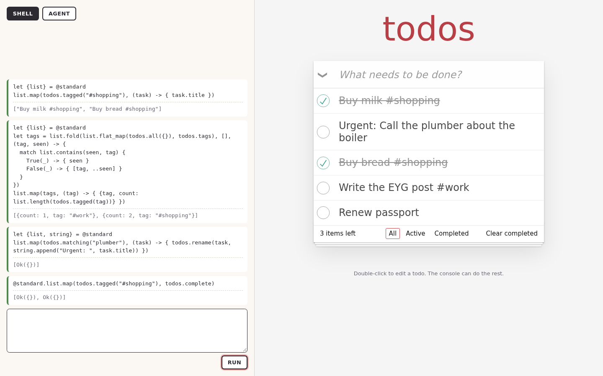
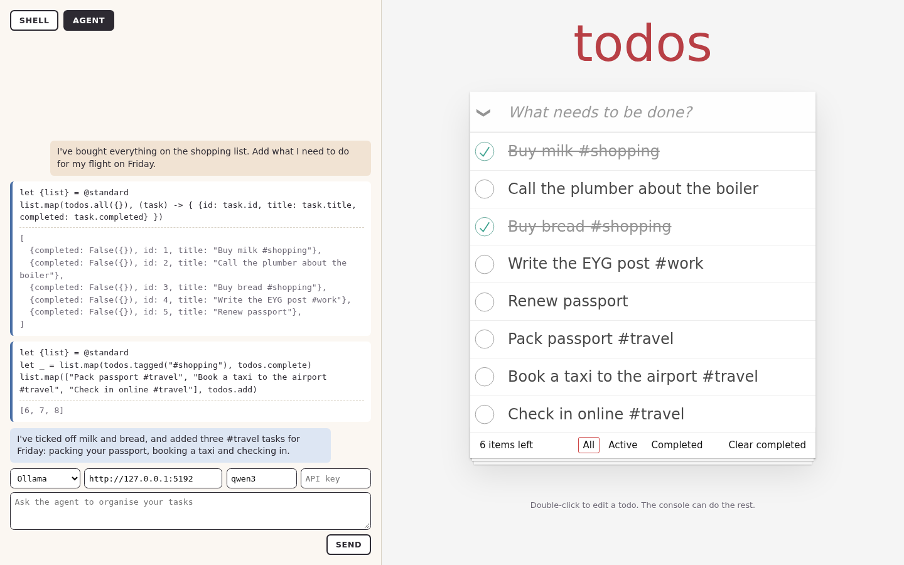

# Querying a todo list with EYG

Every todo app eventually grows a search box, then filters, then saved filters, then a query language.
This post skips to the end: [TodoMVC](https://todomvc.com) in Gleam and Lustre, with a console where the list is queried and changed with [EYG](https://eyg.run).
The console has a shell for people and an agent for everyone else, and both have the same, deliberately narrow, reach.

The code is in [`examples/todomvc_lustre`](../examples/todomvc_lustre).
The shape follows [the hashi example](./embedding_hashi.md): effects, a library, a runner that keeps variables between runs, and an agent with a single tool.
This post is about what is different: the effects are chosen to limit the agent, and programs use a package from the hub.

## Effects that limit the agent

The list is an ordinary Lustre model, and the page can do everything TodoMVC does.
Programs get less:

| Effect | Takes | Returns |
| --- | --- | --- |
| `ListTasks` | `{}` | `List({id, title, completed})` |
| `CreateTask` | `String` | the new id |
| `RenameTask` | `{id, title}` | `Ok({})` or `Error(NotFound({}))` |
| `SetCompleted` | `{id, completed}` | `Ok({})` or `Error(NotFound({}))` |
| `Print` | `String` | `{}` |

There is no `DeleteTask`. An agent asked to tidy up can finish, rename and add, but a program that tries to delete does not type check, so it never starts:

```text
perform DeleteTask(1)
The code did not type check, nothing ran.
line 1: missing row 'DeleteTask'
```

This is the whole permission model, and it is checked before anything runs rather than enforced call by call.
Giving the agent more is adding a row to the table; giving a particular conversation less would be removing one.

## A library that uses the hub

The helpers in [`library.eyg`](../examples/todomvc_lustre/library.eyg) are in scope as `todos`,
and they are written with the standard library:

```eyg
let {list, string} = @standard

let tags = (task) -> { list.filter((word) -> { string.starts_with(word, "#") }, words(task.title)) }

let tagged = (tag) -> { list.filter((task) -> { list.contains(tags(task), tag) }, all({})) }
```

`@standard` is a reference to the latest release of a package on the EYG hub.
Before the shell starts, the page loads everything the library refers to with `cache.load` from `gleam_hub`:
pull the release log, find the module the release names, fetch it, check its content id matches, evaluate it.
The browser supplies the fetching and hashing, which `eyg_embed` has in the shape the cache takes them:

```gleam
cache.load(cache.ready(), source, hub, browser.fetch, browser.hash, fn(_) {
  #(0, 0)
})(promise.resolve)
|> promise.tap(fn(cache) { dispatch(HubLoaded(cache)) })
```

The shell is then given the cache as the place references come from, which serves both the type checker and the interpreter:

```gleam
pub fn start(library: String, cache: Cache(shell.Span)) -> Result(Shell, String) {
  shell.new(effect.types())
  |> shell.with_references(fn(reference) {
    cache.get_reference(cache, reference)
    |> result.map(fn(module) { shell.Module(module.value, module.type_) })
  })
  |> shell.with_module("todos", library)
}
```

A package that is not loaded is a type error, reported before anything runs.
The dev server still proxies `/packages` and `/modules` to eyg.run: the hub now allows any origin to read them, but that change is not deployed yet.

## Queries

With the list and the standard library in scope, queries are short programs. All of these are tests in [`run_test.gleam`](../examples/todomvc_lustre/test/todomvc/run_test.gleam).

Everything tagged for shopping:

```eyg
let {list} = @standard
list.map(todos.tagged("#shopping"), (task) -> { task.title })
```
```text
["Buy milk #shopping", "Buy bread #shopping"]
```

How many tasks carry each tag, without knowing the tags in advance:

```eyg
let {list} = @standard
let tags = list.fold(list.flat_map(todos.all({}), todos.tags), [], (tag, seen) -> {
  match list.contains(seen, tag) {
    True(_) -> { seen }
    False(_) -> { [tag, ..seen] }
  }
})
list.map(tags, (tag) -> { {tag, count: list.length(todos.tagged(tag))} })
```
```text
[{count: 1, tag: "#work"}, {count: 2, tag: "#shopping"}]
```

Changes are queries too. Mark the plumber urgent, then finish the shopping:

```eyg
let {list, string} = @standard
list.map(todos.matching("plumber"), (task) -> { todos.rename(task, string.append("Urgent: ", task.title)) })
```
```eyg
@standard.list.map(todos.tagged("#shopping"), todos.complete)
```



[Watch the shell session](../examples/todomvc_lustre/media/shell.webm).

## The agent

The agent is `eyg_embed`'s, set up as in the hashi example with a different purpose and readme.
The readme lists the effects, the helpers, and `@standard`'s argument orders,
since `list.map` takes the list first and `list.filter` the predicate first.

Asked *"I've bought everything on the shopping list. Add what I need to do for my flight on Friday."*,
it reads the list, then does both halves in one program:

```eyg
let {list} = @standard
let _ = list.map(todos.tagged("#shopping"), todos.complete)
list.map(["Pack passport #travel", "Book a taxi to the airport #travel", "Check in online #travel"], todos.add)
```



[Watch the agent session](../examples/todomvc_lustre/media/agent.webm).
As with hashi, the recording answers `/api/chat` with a fixed script so it can be repeated; the page talks to Ollama or Mistral unchanged.

[A two minute tour](../examples/todomvc_lustre/media/tour.webm) shows it all in one take: type errors, a program with no library, queries with `@standard`,
a `ReadFile` the page never offered, and the agent fixing its own type error from the checker's answer.
The hub's answers are held back three seconds in it, so the loading can be seen.

## What the library saves

The first version of this example was built on the published packages alone, and was mostly copies:
the shell and the agent from the hashi example, changed in a dozen places, and sixty lines of driving the hub cache,
including noticing that a pulled `@name` now names a module nobody had asked for.
Its browser also overflowed the stack, because the cache annotated every fetched module with a continuation passing rewrite.

That was 559 lines. With `eyg_embed`, `cache.load` and a stack safe `ir.map_annotation`,
[`run.gleam`](../examples/todomvc_lustre/src/todomvc/run.gleam) is 51 lines and loading the hub is the call above.
What is left is the part only this host could write: its tasks, its effects and its page.
