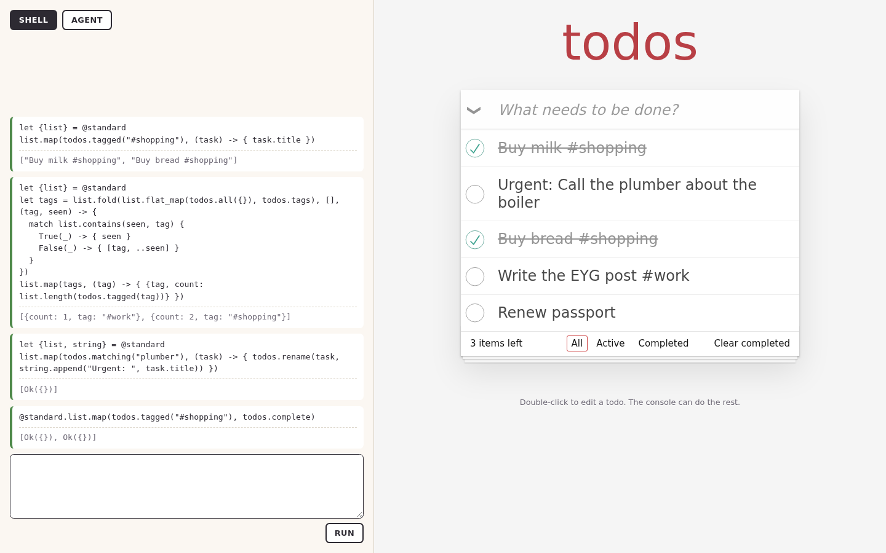

# EYG in a TypeScript app

[The Lustre TodoMVC](./embedding_todomvc.md) gave a todo list a shell and an agent with Gleam on both sides of the fence.
Most web apps are not written in Gleam. This one is TypeScript: the list, the page, the effects and the agent loop.
It uses the same EYG library and gets the same agent, and the page behaves the same way.

The code is in [`examples/todomvc_typescript`](../examples/todomvc_typescript).

## EYG as one module

EYG's implementation is Gleam compiled to JavaScript. [`packages/embed_js`](../packages/embed_js) bundles the parts a host needs,
the shell from `eyg_embed` and the hub cache, into one ES module, `eyg.mjs`, with a `.d.ts`.
A TypeScript app imports it like any other file and needs no Gleam toolchain of its own:

```ts
export function createShell(options: {
  effects: Effects;
  /** Origin of an EYG hub for package references, such as "https://eyg.run". */
  hub?: string;
  /** Modules to put in scope by name, given as source. */
  modules?: Record<string, string>;
}): Promise<Shell>;

export interface Shell {
  text(module: string, field?: string): string;
  run(code: string, handlers: Handlers): Run;
  runAsync(code: string, handlers: AsyncHandlers): Promise<Run>;
}

export interface Run {
  value?: Value;
  display?: string;
  error?: string;
}
```

Three decisions make that API plain.

**Effects are described with data.** The type checker needs each effect's types, and TypeScript cannot build EYG types,
so `eyg.mjs` reads a small type language instead:

```ts
const task = { record: { id: "integer", title: "string", completed: "boolean" } } as const;
const found = { result: { ok: "unit", error: { union: { NotFound: "unit" } } } } as const;

export const effects: Effects = {
  ListTasks: { lift: "unit", lower: { list: task } },
  CreateTask: { lift: "string", lower: "integer" },
  RenameTask: { lift: { record: { id: "integer", title: "string" } }, lower: found },
  SetCompleted: { lift: { record: { id: "integer", completed: "boolean" } }, lower: found },
};
```

**Values cross as plain JavaScript.** Integers are numbers, strings strings, lists arrays, records objects,
`True({})` and `False({})` are booleans, and any other tag is `{$: "Ok", value: ...}`.
So the handlers are ordinary functions:

```ts
export function handlers(tasks: Tasks): Handlers {
  return {
    ListTasks: () => tasks.items.map((task) => ({ ...task })),
    CreateTask: (title: string) => tasks.create(title),
    RenameTask: ({ id, title }) => outcome(tasks.rename(id, title)),
    SetCompleted: ({ id, completed }) => outcome(tasks.setCompleted(id, completed)),
  };
}
```

**Replies are checked.** A program is type checked against the declared effects before it runs,
but TypeScript's types end at the module boundary. So each reply is checked against the effect's declared type
before the program sees it, and a wrong one stops the program with a message naming the effect:

```text
The program stopped.
Add failed: the reply "one" is not a Integer
```

Starting the shell loads `@standard` from the hub for the library, and puts the library in scope:

```ts
const shell = createShell({ effects, hub: location.origin, modules: { todos: library } });
```

`runAsync` goes further than the Gleam shell does on its own: it loads any package a piece of code mentions before running it,
so a person can reach for another package in the middle of a session.

## The same agent

The agent in [`agent.ts`](../examples/todomvc_typescript/src/agent.ts) calls the model's HTTP API directly, about ninety lines.
It has the same system prompt and the same single tool as the Gleam version, and the page answers the tool call with `shell.run`:

```ts
const answer = await agent.ask(text, (code) => {
  const run = current.run(code, handlers(tasks));
  return report(run);
});
```

That is the whole integration. Because the agent's one tool takes a program, the model gets `@standard`, the library,
variables that persist and the type checker's errors through a single tool call, with nothing framework specific.
An agent built with any SDK plugs in the same way.

The page imports the Lustre example's `library.eyg` and stylesheet, so the readme the agent is given, and the helpers it calls, are identical.



[The shell session](../examples/todomvc_typescript/media/shell.webm) and [the agent session](../examples/todomvc_typescript/media/agent.webm)
are the same scripts as the Lustre example's, and end with the same list. As before, the agent's model is a fixed script in the recording.

## What the module saves

The first version of this example had its own Gleam project, a bridge of 444 lines, 138 more copied from the Lustre example to load packages,
and a hand written `.d.ts`. It invented the JSON shape for values and the type language on the way,
and found that a recursive decoder from `gleam/dynamic/decode` built with `one_of` and `field` never ends on bad input.
All of that moved into `eyg_embed`'s `json` module and `embed_js`, and the example lost its Gleam project.
Until `eyg.mjs` is published it is built from the repository, which `bun run dev` does first.
